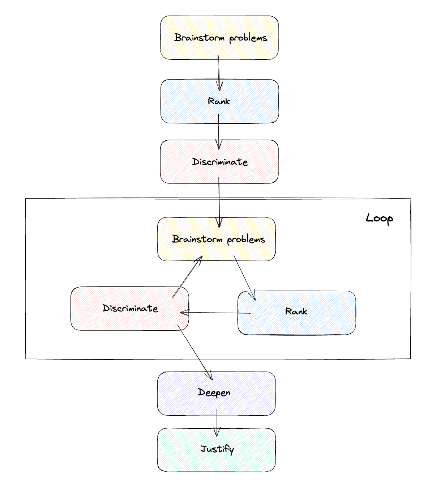

# OpenAI Tree-Based Problem Solver

The OpenAI Tree-Based Problem Solver is an open-source project that leverages the power of OpenAI's language models to solve problems presented in a structured format. The program uses a chained prompt technique and tree-based thought process to iteratively refine solutions to complex problems. The idea was inspired by a YouTube video and has been developed into a functional tool.

## System Requirements
Before getting started, ensure you have the following:

- Git and Python3 installed on your local machine.
- An active OpenAI API key. This key can be found on your [OpenAI account page](https://platform.openai.com/account/api-keys).

## Setup

1. Clone the repository to your local machine using the command `git clone git@github.com:sebastienfi/OpenAI-TreeThoughtSolver.git`.
2. Install the required dependencies with `pip install -r requirements.txt` (or better use `venv` [see here](https://packaging.python.org/en/latest/guides/installing-using-pip-and-virtual-environments/)).
3. Provide your OpenAI API Key. Copy and rename the `.env.example` file to `.env`, then replace the placeholder text in this file with your actual OpenAI API Key. You can do this with the command `cp .env.example .env && code . .env`.

## Execution

1. Define your problem in the `problems.md` file. Problems should be clearly defined and structured. If you need help formulating your problem, you can use ChatGPT to help you summarize your ideas.
2. Execute the program by running the command `streamlit run main.py` in your terminal.
3. Monitor the progress of the problem-solving process through the web application's progress bar.
4. Once the execution is complete, the solution will be output to a file named `solution_<timestamp>.md`. This file contains a detailed breakdown of the problem-solving process and the final solution.

## Output and Results

The detailed results of each run are saved in the `./results` folder. This includes intermediate results from each problem-solving step. Please note that the contents of this folder are overwritten each time you execute the program, so make sure to backup any important results.

## License

This project is open-source and available under the GNU-v3 License. Contributions are welcome!

# 🦠 Example run:
The following is raw contents of `solution_...md`.

# SOLUTIONS

## Stated problems

I am a new Tech Lead in a company which operates over the Spotify organization model (Squads, Chapters, and Matrices). I will operate within a team of Tech Leads. What should I focus on for the first 30 days?

## Initial brainstorm

Solution 1: Understanding the Organizational Structure and Current Projects
Pros: This solution will help you get the lay of the land quickly, giving you a solid foundation to build upon. It will also assist in identifying key stakeholders and understanding their objectives.
Cons: There might be resistance or lack of cooperation from team members or other stakeholders if they are not open to sharing information.
Initial Effort: High. It requires meetings, reading project documentation, and learning about company culture.
Implementation Difficulty: Moderate. It depends on the transparency and complexity of the organization.
Potential Challenges: Resistance from team members, lacking clear or updated documentation.
Expected Outcomes: Clear understanding of the organization, projects, and team dynamics.
Probability of Success: 80%
Confidence Level: High

Solution 2: Focusing on Team Building and Communication
Pros: Strong team dynamics lead to better collaboration and more successful projects. Good communication is key to avoiding misunderstandings.
Cons: It may take time for team members to trust and open up to you as a new Tech Lead. 
Initial Effort: High. You will need to spend time with each team member individually and as a group.
Implementation Difficulty: Moderate. It relies heavily on people skills and the existing culture in the team.
Potential Challenges: Resistance to change, conflicts within the team, different communication styles.
Expected Outcomes: Stronger team cohesion and improved communication.
Probability of Success: 70%
Confidence Level: Moderate

Solution 3: Focusing on Process Improvement and Innovation
Pros: This can result in more efficient processes, less wasted time, and ultimately higher productivity and innovation.
Cons: There may be resistance from team members who are used to current processes or don't see the need for change.
Initial Effort: High. This requires deep diving into current processes, brainstorming sessions, and possibly training sessions.
Implementation Difficulty: High. Changing established processes can be challenging and may face significant resistance.
Potential Challenges: Resistance to change, lack of buy-in from team members or management, implementation issues.
Expected Outcomes: More efficient processes, increased innovation, higher productivity.
Probability of Success: 60%
Confidence Level: Moderate

## Second brainstorm

Solution 2: Facilitating Technical Workshops and Knowledge Sharing

Factor 1 - Conducting Technical Workshops: As a new Tech Lead, you can organize technical workshops where team members share their expertise on specific technologies or projects. This not only helps in spreading knowledge but also gives you a chance to understand the technical depth of your team.

Factor 2 - Promoting Knowledge Sharing: Create a culture of knowledge sharing by encouraging team members to document their work and learnings. This could include creating a shared repository or a platform where everyone can contribute.

Factor 3 - Learning from Others: Take the opportunity to learn from these sessions as well. This will be beneficial for your personal growth and will also set an example for the team about the importance of continuous learning.

Solution 3: Emphasizing on Agile Practices

Factor 1 - Understanding Agile Practices: Learn about the Agile practices followed in your organization. Since Spotify model is an Agile model, it's important to understand how these practices are implemented in your organization.

Factor 2 - Promoting Agile Mindset: Encourage your team to adopt an Agile mindset which includes principles like collaboration, flexibility, continuous improvement, and delivering value to customers quickly.

Factor 3 - Implementing Agile Tools: Start using Agile tools that can help in managing work more efficiently. This could include tools for project management, communication, collaboration, etc.

Included Idea (Solution 1): Understanding the Organizational Structure and Current Projects

In this approach, you will dedicate your initial time to grasp the unique Spotify model of Squads, Chapters, and Matrices, as well as the ongoing projects within your team. This requires high initial effort with meetings, reading project documentation, and learning about the company culture. Although some resistance may be encountered due to lack of cooperation or outdated documentation, the outcome will be a clear understanding of the organization, projects, and team dynamics. 

This approach is promising with an 80% probability of success and a high confidence level. It will provide a solid foundation to build upon and assist in identifying key stakeholders and understanding their objectives.

## Solution
After 3 iterations, we deepened the thoughts on the solution.

Winning Solution: Understanding the Organizational Structure and Current Projects

Potential Scenarios: One potential scenario is that you could be faced with resistance from team members or even other stakeholders. This could be due to a variety of reasons, such as insecurity, territoriality, or a lack of transparency.

Implementation Strategies: To implement this solution, you can start by setting up meetings with different stakeholders, including other Tech Leads, project managers, and team members. You can also request access to all relevant project documentation to understand the current projects better.

Necessary Partnerships/Resources: You would need the cooperation of other Tech Leads, project managers, and team members to get a clear understanding of the ongoing projects. Moreover, you would need access to all the relevant project documentation.

Overcoming Obstacles: If you face resistance from team members or other stakeholders, try to address their concerns. Explain your role and how understanding the organization and projects will help in better decision-making and efficiency. If lack of transparency is the issue due to sensitive information, propose a non-disclosure agreement or similar measures to ensure data security.

Unexpected Outcomes: One unexpected outcome could be realizing that there are significant gaps or issues in the ongoing projects or the organizational structure. In such a case, instead of being overwhelmed, use it as an opportunity to propose improvements. 

Another unexpected outcome could be finding out that there is a lack of documented information about projects. In this case, you might have to spend more time in meetings and discussions to understand the projects properly.

Finally, while studying the organizational structure and current projects, you may identify potential areas for improvement or innovative solutions that hadn't been previously considered. Embrace these insights as opportunities for demonstrating leadership and initiative.

## Final thoughts on the solution

Understanding the Organizational Structure and Current Projects as a winning solution has several merits that make it the optimal choice for a new Tech Lead in an organization that follows the Spotify model. 

Firstly, gaining a comprehensive understanding of the unique organizational structure is crucial to navigate within the company effectively. It allows you to understand how Squads, Chapters, and Matrices interact with each other and where decision-making power lies. This understanding will play a critical role in how you communicate, delegate tasks, and make decisions.

Secondly, understanding current projects is key to identifying priorities and aligning your team's efforts. It will enable you to comprehend the technical requirements, project timelines, potential bottlenecks, and future roadmaps - all essential aspects to lead effectively and drive projects towards successful completion.

While implementing this solution, it's crucial to manage potential resistance from team members or stakeholders. This resistance could emanate from various factors like insecurity, territoriality, or lack of transparency. Addressing their concerns by explaining your role and responsibilities can be helpful in this regard.

Moreover, if there is a lack of transparency due to sensitive information, proposing measures like non-disclosure agreements can assure stakeholders about data security. In case there is a lack of documented information about projects, more in-depth discussions and meetings might be required for proper understanding.

As for unexpected outcomes such as finding significant gaps or issues in ongoing projects or the organizational structure - these should be viewed as opportunities for improvements rather than setbacks.

In conclusion, while this solution demands high initial effort and may encounter challenges such as resistance from team members or lack of updated documentation, it's a promising approach with an 80% probability of success. The expected outcome of having a clear understanding of the organization, projects, and team dynamics will provide a solid foundation for your role as a Tech Lead in the company.